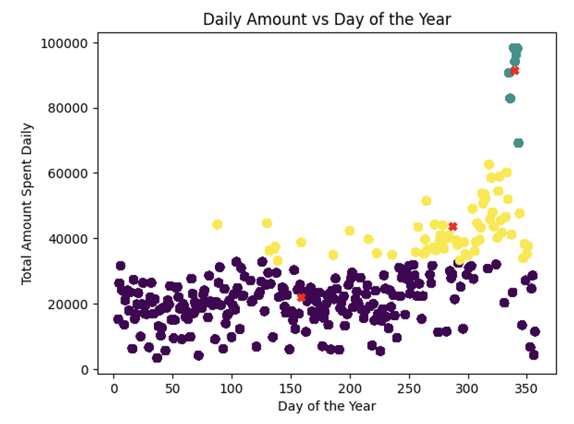

## Models Used

* Linear Regression
* Decision Tree Classifiers
* Support Vector Machines
  * ploy
  * rbf
  * linear
* Kmeans Clustering
* Neural Nets

## Model Results and Comments and Future Improvements

##### Linear Regression
```
Train
R2: 0.0736282081512738
RMSE: 2.1318226059088436

Test
R2: 0.07267753822610223
RMSE: 2.129693450703618
```
###### Discussion: 

After running the model on the test_set I ultimately got the same results. The R2 value changed by ~0.001 and the RMSE changed by less than 0.01. For the inputs I feel that they all provide good insight into the value being predicted, but I don't think its a linear correlation. There were not many challenges here other than getting bad results. It was nice to see that even though its very weak the train and test set performed very similarly. I think a transformation to the data could yeild better results. Potentially a degree 2 or 3 transformation.

In terms of model tuning, tried many different features, but ultimately 0.07 was the highest training score that I was able to get. The final model used the features "daily_transactions", "weekly_transactions" and "average_daily_total".

##### Decision Tree Classifier
```
Train
Accuracy: 0.5236494345046437
Precision: 0.5991819407909049
Sensitivity: 0.5236494345046437
F1 score: 0.5450970820249603

Test
Accuracy: 0.32999676790628885
Precision: 0.37264830938315047
Sensitivity: 0.32999676790628885
F1 score: 0.3404774481151285
```
###### Discussion: 

With this classifier I was trying to predict the week in which a transaction may have taken place (1-52). I deviated away from my original question of predicting price since thats not a categorical value. The features that yeild these results are "average_cust_expend", "total_cust_expend", "total_cost" amd "Quantity".

When looking at the decision tree outcomes it does look promising! The overall Accuracy was 0.52 which is definitely not bad. One thing that you have to watch out for is that decision trees will overfit terribly if you aren't careful. I tried many other combinations of features besides the ones I picked and I would end up with 99 and 100% accuracy. I think that was due to major overfitting and that some of the datapoints were directly linked/created using the feature being predicted so the correlation was extremely accurate. To tune the model it was a lot of playing with different values until I got reasonable metrics that didn't appear to he a case of severe overfit. 

When I reached this part in my research I began to realize that the features I used to use were values that I could only get from the dataset and not easily obtainable for someone that I may want to make a prediction. I started to move to more easibly obtainable features in my predictions and that seemed to improve my outcomes overall as I moved along. The challenge here was identifying features that did and dit not make sense in my predictions. A lot of features would make sense to have correlation with the week value being predicted, but theres far less correlations that what I would have first believed.

##### Support Vector Machines
```
Train
Accuracy: 0.06500979431929481
Precision: 0.008855215922532729
Sensitivity: 0.06500979431929481
F1 score: 0.015019353288875844
```
###### Discussion: 

SVM's are really looking for clustering or distinguishable trends in the data like rings or groups. Based on my exploration this data does not contain anything like that. I ran it through the test set and realized quickly that no improvements were to be had. With scores similar to linear regression I decided to move on to KMeans clustering.

##### Kmeans Clustering



###### Discussion: 

Since KMeans clustering is unsupervised learning that doesnt have the same type of metrics like linear regression or decision trees its hard to determine exactly how well the data did without visualizing it. This use of KMeans clustering did spark an idea in my mind though. I decided that the next best step for predictions using this dataset was to use some type of spending classification. The different category cutoffs can be seen below. 

When looking at the graph above The clustering shows three distinct categories. Those categories in my mind are low, medium and high spenders. To tune the outcomes I tried many different clusters but ultimately settle on the 3 above because it divides the data up on the cleanest way. The main challenge here was deciding if a new question was the best way to go of if I should go down the same path. Ultimately I felt that the categorical prediction made the most sense so I continued on with that. To further improve on the outcomes of the clustering I think I could look into other feature comparisons and see if clusterings there could be more usable or make more sense.

##### Neural Net
```
Train
Accuracy: 0.8458826208426481
Precision: 0.8156721585854939
Sensitivity: 0.8458826208426481
F1 score: 0.8168733903386011

Test
Accuracy: 0.8478859168862205
Precision: 0.81835151071
Sensitivity: 0.8478859168862205
F1 score: 0.8190874456576948
```
###### Discussion: 

The results were very promising from both the test set and the training set! The training set received an accuracy score of 0.83 while the test set got a score of 0.84.

At first I thought that this was a great result and that I had found a correlation that could be used in fairly accurate predictions when it comes to what spending category someone would be at checkout, but I am skeptical. I have a feeling that around 80 of the data falls into category 1 based on the histograms from my intial data exploration. If thats the case then the results that we are getting could be the same or worse than what a dumb model would make if it responded with category 1 for everything. To further improve this we could divide the spending into more categories that split up that 80%. I think that would give us a good insight to if this is a faulty or accurate metric. The main challenge was searhcing for what I felt the best features were to make the model both usable and accurate. I ultimately decided on the "trans_day", "average_cust_expend" and "Quantity" which yeilded the results above.

