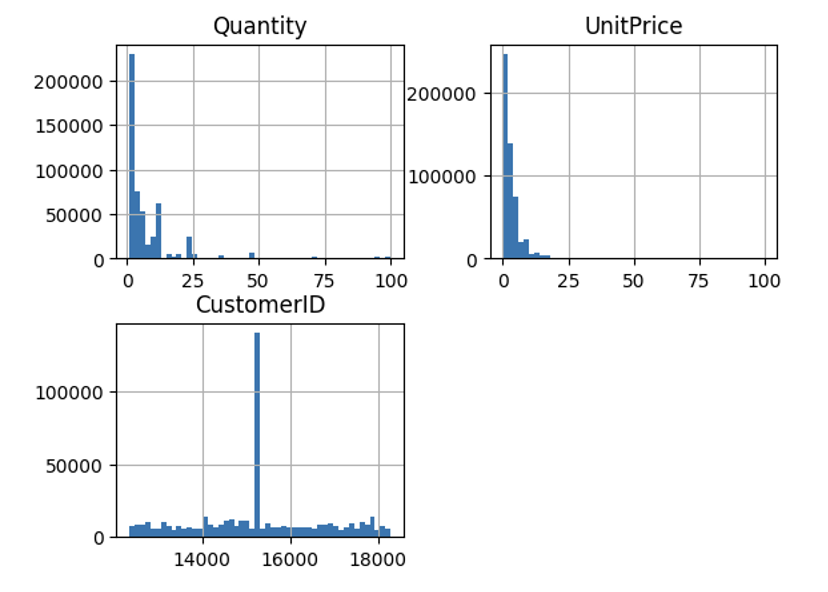
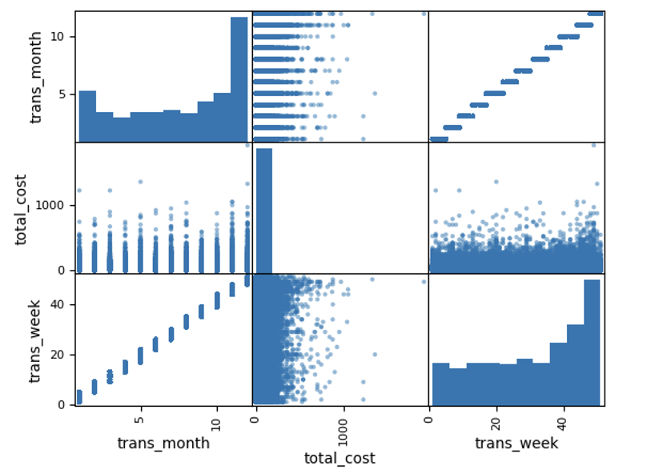
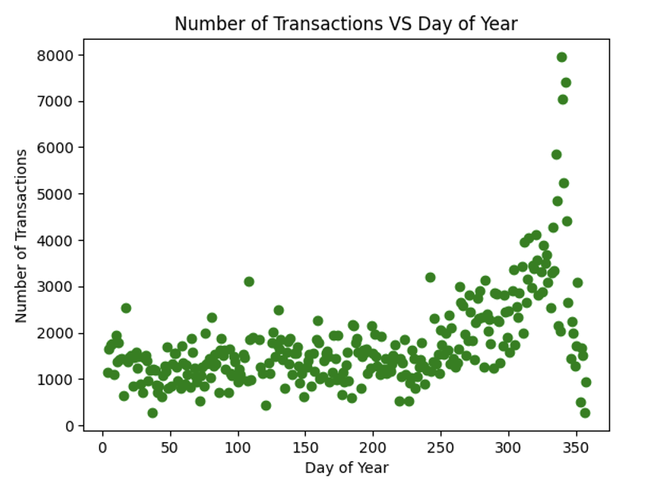
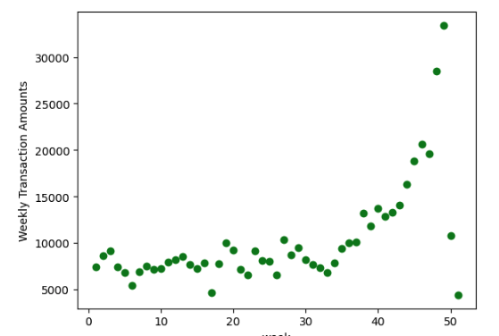

# Exploration Introduction
A full exploration of the data can be found here in the [initial_exploration](intitial_exploration.ipynb) notebook.

To start the exploration I just printed out general information about the dataset using .value_counts() and .info() to see if I could gain insight on what I may need to do to the data later. The main thing that I noticed here is that I would have to do a good amount of working getting the InvoiceDate into a usable state. This including turning it into a datetime object and using that value to gather other information like month, day, etc. I also noticed that there were many more transaction mades below 20 dollars, but I expected that sort of trend.


# Creating and transforming features
I created altered a lot of the data in this dataset to suit the needs of the models I attempted to use. The data cleaning code is present in all notebook files in this dataset, but the most complete can be found in the [classification](classification.ipynb) notebook.  To start I removed any row in my dataset that had irregular values. This included removed cost and quantity values that were negative. I also removed datapoints that seemed to be extreme. I felt that removing these would lower the distance between some key datapoints and provide more accuracy in my predictions. 
```python
dataframe = dataframe[dataframe['UnitPrice'] > 0]
dataframe = dataframe[dataframe['Quantity'] > 0]

dataframe = dataframe[dataframe['UnitPrice'] <= 500]
dataframe = dataframe[dataframe['Quantity'] <= 100]
```

I then spent a lot of time creating new features focused around the InvoiceDate feature. Here I created new features for the day, month, and week feature based on the invoice date in the data row.

```python
dataframe["InvoiceDate"] = pd.to_datetime(dataframe["InvoiceDate"], format='%Y-%m-%d %H:%M:%S')
dataframe['trans_month'] = dataframe['InvoiceDate'].dt.month
dataframe['trans_week'] = dataframe['InvoiceDate'].dt.isocalendar().week
dataframe["trans_day"] = dataframe['InvoiceDate'].dt.dayofyear
```

To gather more information in the time frames created above I created numerous features that computed average and totals cost for the above features. Here is an example of the code I used. More can be found in Part 1 of the [classification](classification.ipynb) notebook.
```python
weekly_cost = []
for i in range(1, 52):
    weekly_cost.append(dataframe[dataframe["trans_week"] == i]["total_cost"].sum())
# add the average weekly total to each row
mapping_dict = dict(zip(range(1, 52), weekly_cost))
dataframe["weekly_total"] = dataframe['trans_week'].map(mapping_dict)
```

Towards the end of the project as I further investigated the data I created spending categories depending on what the average spending was for a customer. There were 2 features created for this. One that contained 3 categories and another than contained 6. The cutoff for each category can be found in the "bins" variable below.

```python
# Create first set of classifications. 3 in total
bins = [0, 20, 100, 10000000]
categories = [1, 2, 3]
# classifying how large or small your expenditure was
dataframe['transaction_spending_classification'] = pd.cut(dataframe["total_cost"], bins=bins, labels=categories, include_lowest=True)

# Create second set of classifications. 6 in total
bins = [0, 20, 50, 100, 150, 200, 10000000]
categories = [1, 2, 3, 4, 5, 6]
# classifying how large or small your expenditure was
dataframe['transaction_spending_classification_v2'] = pd.cut(dataframe["total_cost"], bins=bins, labels=categories, include_lowest=True)
```

# Visualizations
Here are a few key visualizations comparing different feautures of the dataset

When exploring the data I wanted to see if anything really stuck out when looking at counts of different features in my dataset. From this image its obvious that there are many transcations with relatively low quantity, and price. I did find it interesting that there was an extremely large number of transactions that occurred for just one customer. Here is where I began wonder if this is data about a persons spending or companys.



Taking a look at the second histogram showed me two things. There seems to be an increase in transactions toward the end of the month (top left) and that the total cost of transactions seemed to increase towards the end of the year as well. I expect this as the end of the year contains a lot of events that may increase spending such as Christmas and the New Years.



I decided to plot the information that I had found above to see if I could get anymore information with a larger more detailed graph. After plotting the relationship between the number of transactions and the week/day of the year the pattern became much more noticable and easier to see. The finding is these graphs fueled the investigation and further analysis of this relationship to see if I could use it to predict exact prices and then then later on spending categories.





